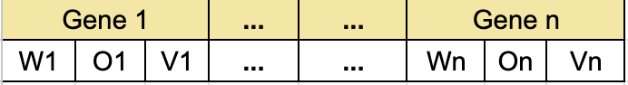

# Classification-rules

-- 
confirmar com a professora
- como atribuir os sinais das operaçoes
- qual o limite da idade
- a partir de quem o fitness é calculado
- perguntar para a professora sobre o trehsold, no artigo fala (por enquanto usar o que a profesora falar)
  - We used a Limit value of 0.3, so that conditions with a weight smaller than or equal to 0.3
    were effectively removed from the rule. Note that mutations in the field weight can cause the corresponding 
    attribute to be removed or re-inserted into the rule.
  - E na aula gravada, fala o contrário

Validaçåo cruzada em teste?

This is an implementation of the Classification Rules algorithm, based on the paper **Discovering Comprehensible Classification Rules with a Genetic Algorithm**
by M.V. Fidelis.

# Chromosome structure

Will be built as following:

**Where**:
 - **W** is a real-valued variable taking values into rang from [0..1]Float. This variable indicates whether the 
   corresponding attribute is present or not in the rule.
   - When `W` is smaller than a user-defined `threshold`, the `i-th` condition is removed from the rule.
   - The greater the value of the `threshold`  the smaller the probability that the corresponding condition will be 
     present in the rule. 
   - The threshold limit used is `0.3` (confirm with Gina about it, it probably is wrong and needs to be updated to 0.7)
     and the signals below changed to `<=` and `>` 
 - **O** indicates the relational operator, `=` and `!=` for (categorical, nominal, usually string or enums) and `>=` and `<` for continuous (float)
   - only the age attribute is linear, the rest are categorical.
   - Age is randomly generated between 0 and 100. (is that correct?)
 - **V** contains one of the values belonging to the domain of attribute `A`, (is coded into binary string which is properly 
   decoded for fitness evaluation -- IS THIS REALLY NEEDED???). The number of bits used to encode V is proportional to the number of values in the
   domain of attribute `A`.

> **Note**
> Each chromosome has a fixed length, the genes are interpreted (based on the weight value W) in such
> way the phenotype (the rule) has a variable length.

Example on how it would look like (this is the AG individual representation): 

# AG Parameters
PS: the operatios will also happen in the same order of below:
- Population size is **50**
- Generations **50**
- Stochastic tournament with size **3**
- Two-point crossover
  - Crossover probability **100%**, which means all individuals will be crossed.
- Mutation rate: **30%** in each gene's field.
- Reproduction strategy:
  - elitism: best individual is passed to the next generation unchanged.

## Mutation operations

- **Weight mutation**: Mutate the wight, this operation generates a small real-valued number that is then added
  or subtracted from the current weight of the condition, then can be used to decide if the condition will be added 
  or removed from the rule.
- **relational operator mutation**: modifies the relational replacing it another valid relational operators randomly 
  depending on whether the attribute is categorical or continuous
- **value mutation**: modifies the content of the field value (V) by replacing the current value with another randomly 
  generated, there are two possible cases:
  - If the attribute is categorical replaces with another value from the domain of the attribute.
  - If is continuous, the mutation produces a small number that is added or subtracted from the current value.
    - _Implementation details_: the lower and the upper bounds of the domain attribute are never exceeded.
    - The age is a range from 0 to 100. 

Each of these operators act on different field of the gene.

## Fitness function

- _Sensitivity_:
  - Se = tp / (tp + fn)
- _Specificity_:
  - Sp = tn / (tn + fp)
- _Fitness_:
  - **F = Se * Sp**
  - F = Se + Sp) / 2 (ignore for now randomly proposed)
  - F = Se + Sp) (ignore for now randomly proposed)

The goal of the fitness function is maximization.

**Where**:

- **True positive** (tp) - the rule predicts that the patient has a given disease and the.patient really have that disease;
- **False positive** (fp) - the rule predicts that the patient has a given disease but the patient does not have it;
- **True negative** (tn) - the rule predicts that the patient does not have a given disease, and indeed the patient does not have it;
- **False negative** (fn) - the rule predicts that the patient does not have a given disease but the patient does have it.

More details on how it is calculated can be found in the **Fitness** class.

## How to calculate the fitness

To generate the fitness, we need to read the dataset and compare the values from the rule with the values from the dataset.

## Classes

### The Dermatology dataset has 6 classes:
- Psoriasis
- Seboreic dermatitis
- Lichen planus
- Pityriasis rosea
- Chronic dermatitis
- Pityriasis rubra pilaris

### Breast cancer dataset has 2 classes:
- Malignant
- Benign

> **Note**
> If there are 6 classes, then the GA needs to be run 6 times, one for each class.

# Datasets:

## Dermatology dataset
- https://archive.ics.uci.edu/ml/datasets/dermatology

The Dermatology dataset has 34 attributes, 33 of them are categorical and 1 is continuous.
The training base is composed of 2/3 and the test base is composed of 1/3 of the remaining data.
Both bases are randomly generated for each class.

Breast cancer dataset: https://archive.ics.uci.edu/ml/datasets/Breast+Cancer+Wisconsin+%28Diagnostic%29

> **Warning**
> This is a warning

# fb0b63de298a4a87b8c09f3a38e2e09a4c98
